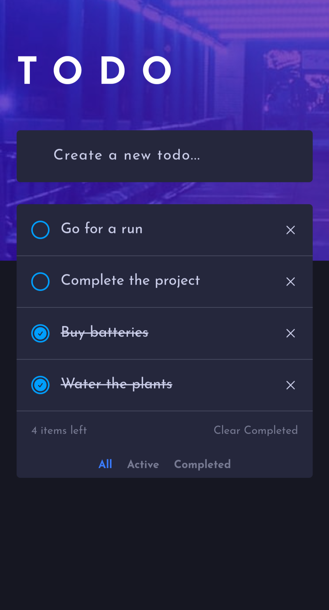

# Todo app

This is a Todo app which I built from one of the [Frontend Mentor](https://www.frontendmentor.io/challenges/todo-app-Su1_KokOW) challenges.

## Table of contents

- [Overview](#overview)
  - [Screenshot](#screenshot)
  - [Links](#links)
  - [Built with](#built-with)
- [Author](#author)

## Overview

### Screenshot

### Links

- Live Site URL: [Live Site URL here](https://acgeoffrey.github.io/todo/)

## My process

### Built with

- HTML5 markup
- CSS
- Javascript

## Author

- Geoffrey
