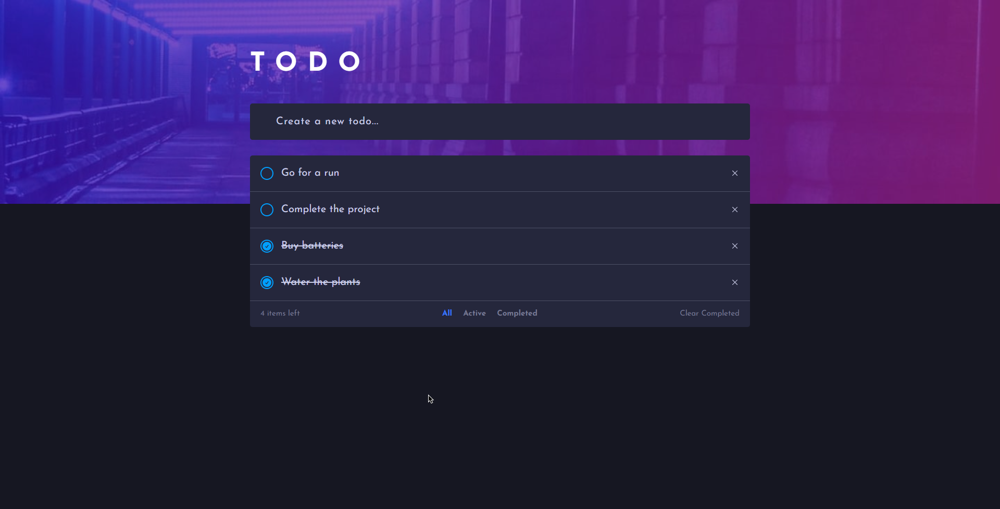
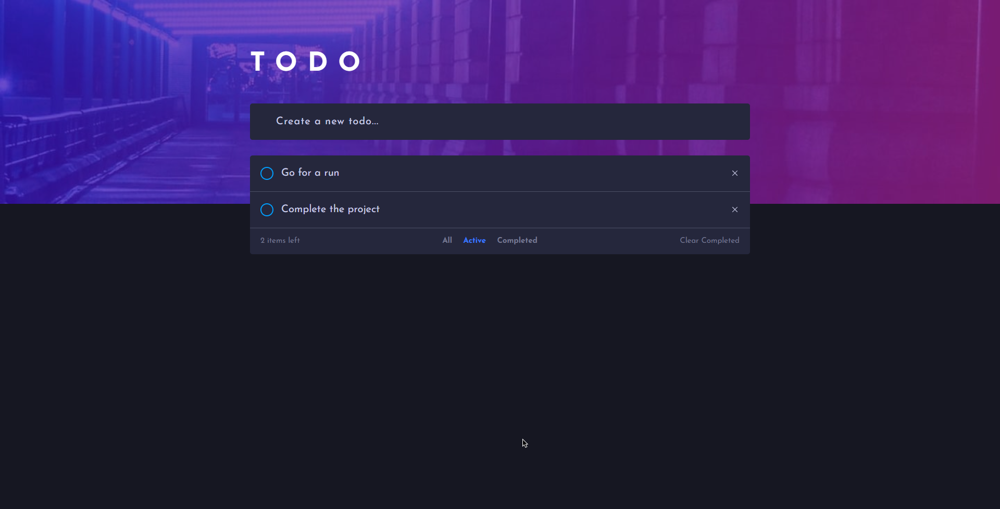
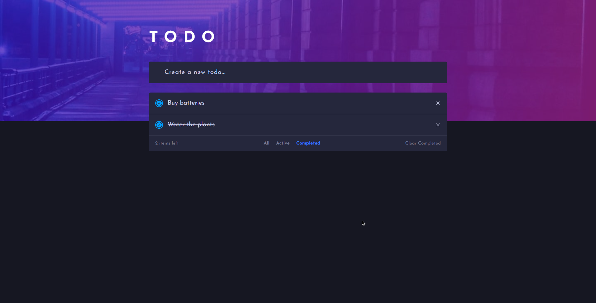

# Todo app

This is a simple Todo app which I built from one of th [Frontend Mentor](https://www.frontendmentor.io/challenges/todo-app-Su1_KokOW) challenges.

## Table of contents

- [Overview](#overview)
  - [Screenshot](#screenshot)
  - [Links](#links)
  - [Built with](#built-with)
- [Author](#author)

## Overview

### Screenshot

### Links

- Live Site URL: [Live Site URL here](https://acgeoffrey.github.io/todo/);

## My process

### Built with

- HTML5 markup
- CSS
- Javascript

## Author

- Geoffrey

**Note: Delete this note and add/remove/edit lines above based on what links you'd like to share.**

## Acknowledgments

This is where you can give a hat tip to anyone who helped you out on this project. Perhaps you worked in a team or got some inspiration from someone else's solution. This is the perfect place to give them some credit.

**Note: Delete this note and edit this section's content as necessary. If you completed this challenge by yourself, feel free to delete this section entirely.**
